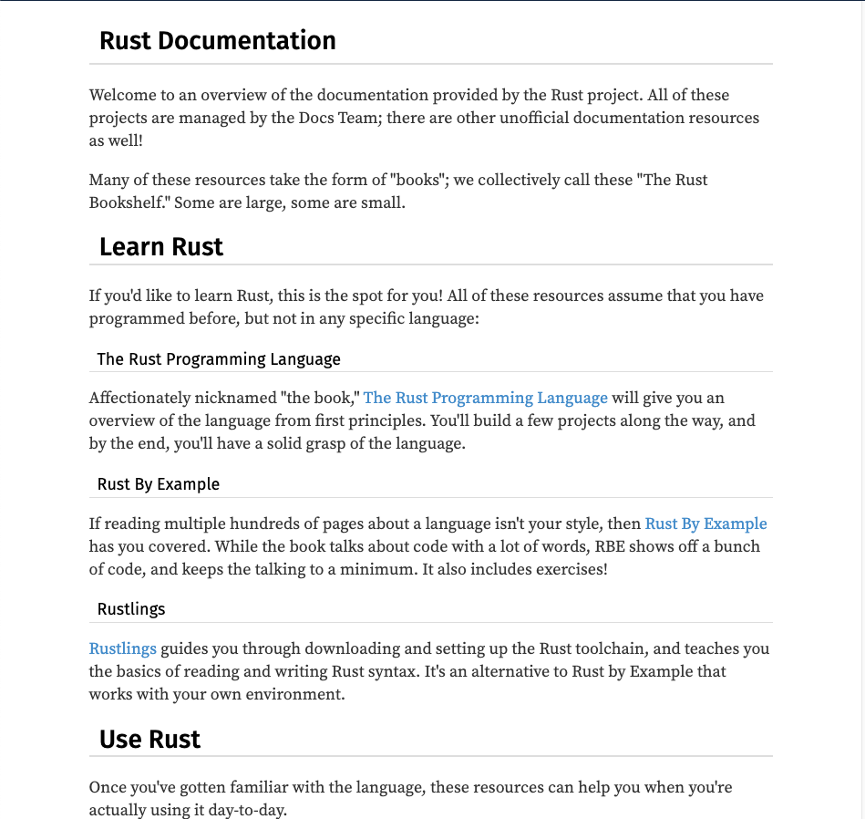

# CHAPTER 01 시작하기

## 1.1 설치

### 1.1.1 macOS

아래의 명령어를 실행한다.

```shell
$ curl https://sh.rustup.rs -sSf | sh
```

스크립트 파일을 하나 내려받은 후 `rustup` 도구와 함께 최신 안정 버전의 러스트를 시스템에 설치한다. 성공적으로 설치가 완료되면 다음과 같은 결과를 나타난다.

```
Rust is installed now.. Great!
```

다음 명령을 이용, 러스트를 시스템 `PATH` 변수에 수동으로 등록한다.

```shell
$ source $HOME/.cargo/env
```

### 1.1.2 업데이트와 제거

업데이트는 아래의 명령어를 이용하면 된다.

```shell
$ rustup update
```

```
info: syncing channel updates for 'stable-x86_64-apple-darwin'
info: checking for self-updates

  stable-x86_64-apple-darwin unchanged - rustc 1.40.0 (73528e339 2019-12-16)

info: cleaning up downloads & tmp directories
```

`rustup` 도구와 러스트를 제거하려면 셸에서 다음의 제거 스크립트를 실행하면 된다.

```shell
$ rustup self uninstall
```

```
Thanks for hacking in Rust!

This will uninstall all Rust toolchains and data, and remove
$HOME/.cargo/bin from your PATH environment variable.

Continue? (y/N) y

info: removing rustup home
info: removing cargo home
info: removing rustup binaries
info: rustup is uninstalled
```

### 1.1.3 버전 확인

버전 확인은 다음 명령어를 입력한다.

```shell
$ rustc --version
```

```
rustc 1.40.0 (73528e339 2019-12-16)
```

이 정보를 볼 수 없다면 러스트 실행 파일이 `%PATH%` 시스템 변수에 등록되어 있는지를 확인하자.

### 1.1.4 로컬 문서 서버

```
$ rustup doc
```

위 명령어를 실행하면 웹 브라우저에서 아래의 로컬 문서를 읽을 수 있다.




## 1.2 첫 번째 러스트 프로그램 작성하기

### 1.2.1 프로젝트 디렉터리 만들기

개인 취향에 맞게 프로젝트 디렉터리를 생성한 후 이 디렉터리 아래에 다시 Hello, World! 프로젝트를 위한 디렉터리를 생성하자.

```
$ cd ~/Sources/rust
$ mkdir ch01
$ cd ch01
$ mkdir hello_world
$ cd hellow_world
```

### 1.2.2 러스트 프그램의 작성과 실행

`main.rs` 파일을 생성 후 아래의 코드를 입력한다.

파일명에 하나 이상의 단어를 사용하려면 밑줄(_)를 이용해 단어를 구분한다. (`hello_world.rs`)

```rust
fn main() {
	println!("Hello, World!");
}
```

아래의 명령어를 이용해 컴파일하고 실행을 할 수 있다.

```
$ rustc main.rs
$ ./main
Hello, World!
```

